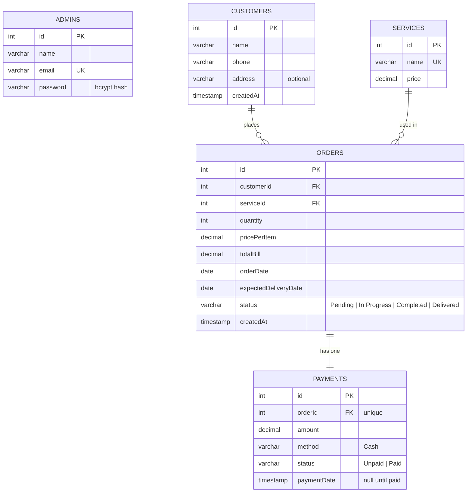

# Database ER Diagram

```mermaid
erDiagram
  ADMINS {
    int id PK
    varchar name
    varchar email UK
    varchar password "bcrypt hash"
  }
  CUSTOMERS {
    int id PK
    varchar name
    varchar phone
    varchar address "optional"
    timestamp createdAt
  }
  SERVICES {
    int id PK
    varchar name UK
    decimal price
  }
  ORDERS {
    int id PK
    int customerId FK
    int serviceId FK
    int quantity
    decimal pricePerItem
    decimal totalBill
    date orderDate
    date expectedDeliveryDate
    varchar status "Pending | In Progress | Completed | Delivered"
    timestamp createdAt
  }
  PAYMENTS {
    int id PK
    int orderId FK "unique"
    decimal amount
    varchar method "Cash"
    varchar status "Unpaid | Paid"
    timestamp paymentDate "null until paid"
  }
  CUSTOMERS ||--o{ ORDERS : places
  SERVICES ||--o{ ORDERS : "used in"
  ORDERS ||--|| PAYMENTS : "has one"
```

`ADMINS` is standalone (login only). Deleting a customer cascades to their orders and payments; a service cannot be deleted while orders use it (RESTRICT).
